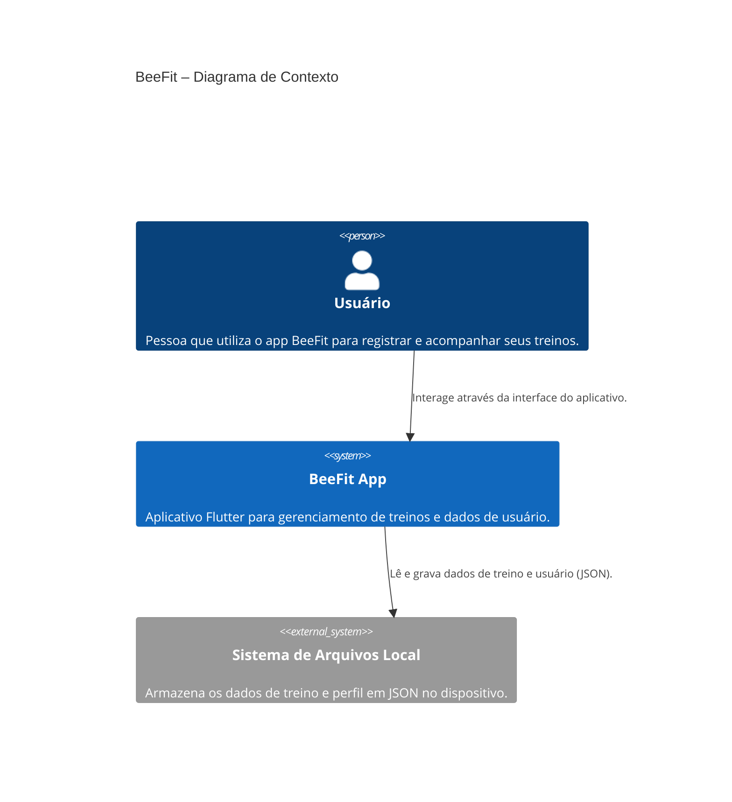
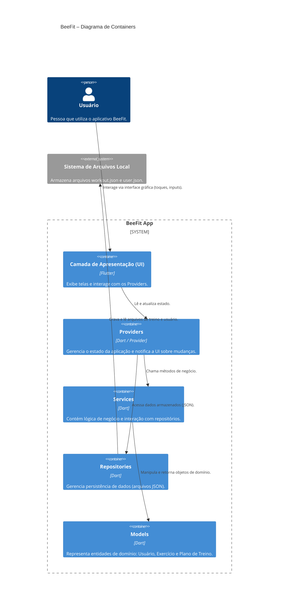
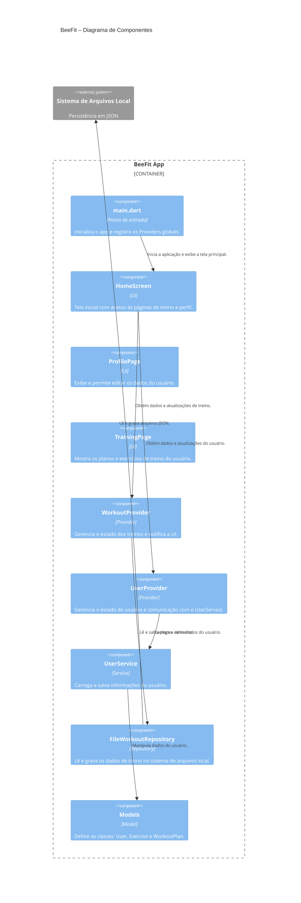

# BeeFit

BeeFit — Seu Organizador Inteligente de Treinos

FitPlanner é um aplicativo mobile projetado para organizar, otimizar e acompanhar treinos de academia, tanto para atletas iniciantes quanto para os mais avançados.
Com integração a dispositivos inteligentes e recursos avançados de personalização, o app ajuda você a treinar de forma mais eficiente, monitorando seu progresso e tornando o treino mais motivador.

📱 Funcionalidades Principais
📅 Organização de Treinos

Visualize seu horário de treino, lista de exercícios, número de séries e carga por exercício.

Classificação de séries: aquecimento, workset e topset.

Técnicas avançadas: drop-set, progressão automática de carga, periodização automática configurável.

📊 Acompanhamento e Estatísticas

Integração com pulseiras e balanças inteligentes para atualizar:

Calorias gastas

Tempo de treino

Peso corporal

Registro do progresso: aumento de carga, repetições e desempenho geral.

🧠 Treinos Personalizados com IA

Geração de treinos automáticos via integração com API de LLM.

Personalização baseada em:

Modalidade de treino

Objetivos

Peso, altura, gênero e experiência

Ajuste automático de exercícios de acordo com lesões ou equipamentos disponíveis.

👥 Modo Treinador

Usuários treinadores podem adicionar alunos e acompanhar:

Treino atual

Estatísticas de evolução

Alunos podem modificar o treino livremente.

🏆 Competitividade e Rankings

Adicione amigos e compare resultados em rankings de:

Carga levantada

Número de repetições

Progressão

Rankings personalizados por grupo de amigos.

🎥 Banco de GIFs

Biblioteca visual com GIFs de execução correta para cada exercício.

🚀 Tecnologias Utilizadas

Frontend: Framework mobile (ex.: React Native ou Flutter)

Backend: API REST + integração com LLM

Banco de Dados: PostgreSQL / MongoDB

Integrações: APIs de wearables (Google Fit, Apple Health, etc.)

Arquitetura do Projeto BeeFit
1. Estilo Arquitetural Adotado

O aplicativo BeeFit foi desenvolvido em Dart utilizando o framework Flutter, adotando uma arquitetura em camadas (Layered Architecture) combinada com o padrão MVVM (Model–View–ViewModel).
Esse estilo separa as responsabilidades principais em módulos independentes, garantindo baixo acoplamento e alta coesão entre componentes.

A estrutura do projeto é composta por cinco camadas principais:

Models (/models) – Contêm as classes que representam as entidades de domínio, como User, Exercise e WorkoutPlan.
São estruturas de dados puras, sem dependências diretas de camadas superiores.

Repositories (/repositories) – Responsáveis pelo acesso e persistência de dados.
O repositório FileWorkoutRepository utiliza armazenamento local em arquivos JSON para gravar e recuperar informações de treino, abstraindo detalhes de persistência.

Services (/services) – Fornecem lógica de negócios específica e interações entre entidades.
O UserService gerencia o carregamento e a atualização dos dados do usuário, servindo como camada intermediária entre o UserProvider e a fonte de dados.

Providers (/providers) – Implementam o gerenciamento de estado reativo do aplicativo.
Utilizam o pacote Provider do Flutter (via ChangeNotifier) para notificar as interfaces gráficas (screens) sobre atualizações de dados em User e WorkoutPlan.

Screens (/screens) – Representam a camada de apresentação (View).
Contêm as telas e widgets que exibem os dados ao usuário e interagem com os providers para reagir às mudanças de estado.

Essa divisão segue o fluxo unidirecional de dados, conforme ilustrado abaixo:
UI (Screens) → Providers → Services / Repositories → Models
                      ↑
                notifyListeners()

Essa abordagem promove facilidade de manutenção, testabilidade e clareza de dependências, sendo adequada para projetos Flutter de médio porte com estado local e persistência simples.

2. Modelo C4 da Arquitetura
Nível 1 – Diagrama de Contexto

Objetivo: Representar o sistema BeeFit em seu ambiente operacional.

| Elemento                               | Descrição                                                                                 |
| -------------------------------------- | ----------------------------------------------------------------------------------------- |
| **Usuário (Atleta)**                   | Pessoa que utiliza o app para registrar e organizar seus treinos.                         |
| **Sistema BeeFit (Aplicativo Mobile)** | Aplicativo Flutter responsável por armazenar e exibir os dados de treino e progresso.     |
| **Sistema de Arquivos Local**          | Ambiente de persistência no dispositivo móvel, usado para salvar treinos em formato JSON. |

Interações:

O Usuário interage com o App BeeFit via interface gráfica.

O App BeeFit lê e grava informações de treino e perfil no sistema de arquivos local.

Nível 2 – Diagrama de Containers

Objetivo: Representar os principais contêineres do sistema BeeFit.

| Container                                          | Função Principal                                           | Tecnologia                |
| -------------------------------------------------- | ---------------------------------------------------------- | ------------------------- |
| **App Flutter (UI Layer)**                         | Gerencia a interface e interação com o usuário.            | Flutter / Dart            |
| **Gerenciador de Estado (Providers)**              | Controla o estado global e notifica a interface.           | Provider + ChangeNotifier |
| **Serviço de Usuário (UserService)**               | Processa regras de negócio e mediação de dados do usuário. | Dart                      |
| **Repositório de Treinos (FileWorkoutRepository)** | Realiza leitura e escrita em arquivos JSON locais.         | Dart + path\_provider     |
| **Sistema de Arquivos do Dispositivo**             | Armazena os arquivos `workout.json` e outros dados locais. | Android/iOS file system   |

Fluxo resumido:

O usuário interage com a UI.

A UI aciona o Provider, que coordena operações.

O Provider consulta ou atualiza dados via Service ou Repository.

Os resultados são propagados de volta à UI por meio de notificações reativas.

Nível 3 – Diagrama de Componentes

Objetivo: Mostrar os componentes internos e suas responsabilidades.

| Componente                                        | Localização     | Responsabilidade                                                     |
| ------------------------------------------------- | --------------- | -------------------------------------------------------------------- |
| **`main.dart`**                                   | raiz            | Inicializa o app e configura os providers globais.                   |
| **`UserModel` / `WorkoutPlan` / `ExerciseModel`** | `/models`       | Representam as entidades centrais do domínio.                        |
| **`UserService`**                                 | `/services`     | Lida com carregamento e gravação de dados do usuário.                |
| **`FileWorkoutRepository`**                       | `/repositories` | Persiste e recupera treinos do sistema de arquivos local.            |
| **`UserProvider` / `WorkoutProvider`**            | `/providers`    | Gerenciam estado, encapsulam lógica de atualização e notificam a UI. |
| **`HomeScreen`, `TrainingPage`, `ProfilePage`**   | `/screens`      | Camada de apresentação e navegação entre as funcionalidades.         |

Relações entre componentes:

As screens dependem dos providers.

Os providers dependem de services e repositories.

services e repositories manipulam models e acessam o sistema de arquivos.

3. Padrão de Projeto Adotado: Singleton
O padrão de projeto Singleton foi adotado neste projeto para o componente responsável pela persistência de dados locais, implementado no arquivo repositories/workout_repository.dart.

O Singleton tem como objetivo garantir que exista apenas uma instância de uma determinada classe durante toda a execução do aplicativo. Esse padrão é comumente utilizado em situações onde múltiplas instâncias poderiam gerar inconsistências de estado, acessos concorrentes a recursos compartilhados ou sobrecarga desnecessária de memória.

No contexto do aplicativo BeeFit, esse padrão foi aplicado à classe FileWorkoutRepository, que é responsável por ler e gravar os planos de treino no arquivo local workout.json. A adoção do Singleton nesse componente assegura que todas as operações de leitura e escrita sejam centralizadas em uma única instância, evitando conflitos e garantindo integridade dos dados armazenados.

A modificação consistiu em:

Substituir o construtor público da classe por um construtor factory que retorna sempre a mesma instância estática da classe;

Tornar o construtor original privado, impedindo a criação de novas instâncias fora da própria classe;

Manter a lógica de persistência e carregamento inalterada, assegurando compatibilidade total com as demais camadas do aplicativo.

Essa abordagem melhora a consistência do acesso ao repositório, reduz o risco de condições de corrida durante operações de I/O e segue boas práticas de design orientado a objetos em aplicativos Flutter que fazem uso de armazenamento local.