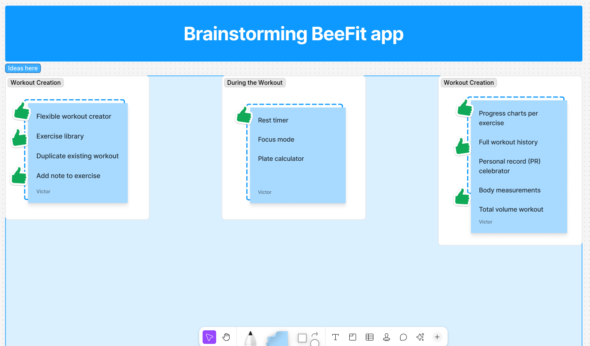

# **BeeFit: Documento de Elicitação e Estratégia de Requisitos**

| Projeto | BeeFit - Gerenciador Inteligente de Treinos de Musculação |
| :--- | :--- |
| **Equipe** | Victor Itiro Ogitsu, Nicholas Pucharelli Fontanini, Jociclelio Castro Macedo Junior, Iran Seixas Lopes Neto, Rafael Attilio Agricola    |
| **Data** | 23/10/2025 |

## 1. Introdução

Este documento detalha o processo de elicitação de requisitos para o aplicativo BeeFit. Utilizamos uma abordagem combinada de **Benchmarking** para analisar o cenário de mercado e **Brainstorming** para gerar ideias inovadoras. O objetivo é definir um conjunto claro de funcionalidades para o nosso *Minimum Viable Product* (MVP), garantindo que o BeeFit entregue valor real e se diferencie da concorrência desde o seu lançamento.

---

## 2. Benchmarking (Análise Competitiva)

### 2.1. Metodologia

Analisamos 3 (três) aplicativos concorrentes com base em suas funcionalidades, modelo de negócio, experiência do usuário (UI/UX) e feedback público (avaliações na App Store e Play Store). O objetivo foi identificar padrões de mercado, funcionalidades essenciais (*table stakes*) e oportunidades de diferenciação.

**Aplicativos Analisados:**
*   **Strong:** Famoso pela simplicidade e foco no registro de dados.
*   **Jefit:** Conhecido pela vasta biblioteca de exercícios e planos de treino.
*   **Hevy:** Destaque para o aspecto social e design moderno.

### 2.2. Tabela Comparativa de Funcionalidades

| Funcionalidade | Strong | Jefit | Hevy | Implicação Estratégica para o BeeFit |
| :--- | :---: | :---: | :---: | :--- |
| **Criação de Treino Livre e Flexível** | ✅ | ✅ | ✅ | **Não negociável.** Nossa interface para isso deve ser a mais rápida e intuitiva do mercado. |
| **Biblioteca de Exercícios com Mídia** | ✅ | ✅ | ✅ | Essencial para guiar o usuário. Podemos começar com GIFs (mais leves) e evoluir para vídeos. |
| **Logging Avançado (Notas, Séries, Carga)** | ✅ | ✅ | ✅ | **Obrigatório.** É o *core loop* do app. Deve ser extremamente fácil registrar um set. |
| **Cronômetro de Descanso Automático** | ✅ | ✅ | ✅ | Implementar de forma inteligente e não intrusiva. Customização é um diferencial. |
| **Gráficos e Relatórios de Progresso** | ✅ | ✅ | ✅ | Focar em visualizações que importam: volume total, 1RM estimado, recordes pessoais. |
| **Componente Social (Feed, Amigos)** | ❌ | ✅ | ✅ | **Oportunidade.** Podemos adiar isso para focar 100% na experiência individual, que é uma dor em apps com excesso de features sociais. |
| **Backup em Nuvem** | Apenas Pago | ✅ | ✅ | Oferecer backup gratuito é um diferencial poderoso para aquisição e retenção de usuários. |
| **Modelo de Monetização** | Assinatura | Freemium | Freemium | Adotar um modelo Freemium justo, onde o *core* do app é gratuito e funcionalidades avançadas são pagas. |

### 2.3. Principais Insights da Análise

*   **Ponto Forte dos Concorrentes:** Todos são excelentes em registrar dados. A interface limpa do Strong e o aspecto social do Hevy são os maiores destaques.
*   **Ponto Fraco (Dor do Usuário):** As principais queixas são sobre interfaces que se tornaram muito complexas com o tempo, paywalls agressivos que bloqueiam funções básicas e a falta de flexibilidade na edição de treinos já iniciados.
*   **Nossa Oportunidade:** O BeeFit pode se destacar ao focar na **velocidade e simplicidade da experiência de treino**. Menos cliques para registrar, edição fácil e um design limpo, sem poluição visual.

---

## 3. Sessão de Brainstorming

### 3.1. Metodologia

Realizamos uma sessão de ideação em equipe utilizando a ferramenta **FigJam**. Durante 60 minutos, geramos ideias livremente (`fase de divergência`) e depois agrupamos em temas e votamos nas prioridades (`fase de convergência`) para definir o escopo do nosso MVP.

### 3.2. Evidências

**Quadro de Brainstorming no FigJam:**

A imagem abaixo é um snapshot do nosso processo, mostrando as ideias agrupadas e as mais votadas.

### 3.3. Ideias Prioritárias e Temas Emergentes

*   **Tema 1: O Essencial Bem Feito**
    *   **Criador de Treino "Arrasta e Solta":** Facilitar a montagem e reordenação de exercícios.
    *   **"Modo Foco" durante o treino:** Interface minimizada com apenas o exercício atual, timer e campos de registro.
    *   **Histórico Inteligente:** Ao selecionar um exercício, mostrar a última carga e repetições realizadas para facilitar a progressão de carga.

*   **Tema 2: Pequenos Diferenciais ("Delighters")**
    *   **Sugestão de Placas/Anilhas:** Com base no peso que o usuário quer levantar, o app sugere a combinação de anilhas.
    *   **Celebração de Recordes Pessoais (PRs):** Pequenas animações ou feedbacks visuais ao bater um recorde.
    *   **Modo Escuro (Dark Mode) nativo.**

---

## 4. Questionário Estruturado (Pesquisa de Opinião)

### 4.1. Metodologia

Criamos e distribuímos um **Google Forms** com 18 respondentes (usuários reais de musculação, calistenia, corrida, lutas, etc.), com idades entre 16 e 30 anos, níveis de experiência variando de iniciante a experiente. O formulário continha:

*   Perguntas demográficas e de perfil (idade, frequência, objetivos, modalidades).
*   Pergunta aberta sobre **dificuldades principais**.
*   Avaliação de **17 funcionalidades propostas** em escala de 1 a 5 (1 = nada útil, 5 = extremamente útil).
*   Campo aberto para sugestões adicionais.

**Link do Formulário (evidência):** [https://forms.gle/...](https://forms.gle/...) *(link real deve ser inserido pela equipe)*  
**Planilha de Respostas (evidência):** `BeeFit elicitação de requisitos.xlsx` (anexada no repositório ou disponível via link compartilhável).

### 4.2. Perfil dos Respondentes

| Característica | Resumo |
|----------------|--------|
| **Idade média** | ~22 anos |
| **Frequência de treino** | 70% treinam 4–5x/semana |
| **Nível de experiência** | 11 Intermediário, 6 Avançado, 1 Iniciante, 1 Experiente |
| **Objetivos principais** | Hipertrofia (88%), Saúde (66%), Condicionamento (50%), Emagrecimento (44%) |
| **Modalidades** | Musculação (100%), Corrida/Calistenia/Lutas (variável) |

### 4.3. Dificuldades Relatadas (Síntese Qualitativa)

| Dificuldade | Frequência | Exemplos |
|-------------|------------|---------|
| Organização de treinos (dias, horários, sequência) | Alta | "organizar a rotina", "agrupamento por região", "conciliar com faculdade" |
| Escolha de exercícios, séries, repetições e carga | Alta | "saber quais exercícios fazer", "progressão de carga sem machucar" |
| Falta de orientação visual (execução correta) | Média | "saber como é a execução e a máquina" |
| Tempo de descanso e cronometragem | Média | "cronômetro entre séries", "timer de intervalo" |
| Motivação e acompanhamento de progresso | Baixa-Média | "bater recordes", "ver evolução" |

### 4.4. Avaliação das Funcionalidades Propostas (Média das Notas – 18 respostas)

| Funcionalidade | Média (1–5) | Prioridade |
|----------------|-------------|----------|
| Organização de treinos por dia/horário | **4.78** | Alta |
| Organizar exercícios com carga, séries, repetições | **4.61** | Alta |
| Banco de GIFs para execução correta | **4.50** | Alta |
| Possibilidade de criar treinos próprios | **4.33** | Alta |
| Timer de intervalo de descanso | **4.22** | Alta |
| Histórico e progresso (gráficos, 1RM) | **4.17** | Alta |
| Notificação de lembrete de treino | **4.11** | Alta |
| Metas pessoais | **4.06** | Alta |
| Integração com treinadores | **4.00** | Média-Alta |
| Inclusão de técnicas avançadas (drop-set, etc.) | **3.94** | Média-Alta |
| Progressão automática de carga | **3.89** | Média-Alta |
| Integração com smartwatch/balanças | **3.83** | Média |
| Inclusão de aquecimento, workset, topset | **3.83** | Média |
| Geração automática de treino por IA | **3.72** | Média |
| Competição entre usuários | **3.17** | Baixa-Média |
| Detecção de forma por IA | **3.11** | Baixa |
| Geolocalização (atividades externas) | **2.94** | Baixa |

### 4.5. Sugestões Livres (Destaques)

*   "Cronômetro em cada exercício seria essencial"
*   "Dicas de dieta ou doces fit"
*   "Registrar medidas corporais"
*   "Sincronizar com Apple Watch e mostrar calorias por exercício"
*   "Evitar anúncios excessivos"

### 4.6. Insights da Pesquisa

*   **Validação clara do core:** Usuários **exigem** organização, logging detalhado, timer e orientação visual.
*   **Alta demanda por personalização:** Criar treinos próprios + progressão de carga são quase unanimidade.
*   **Funcionalidades experimentais (IA, competição, geolocalização) têm baixa prioridade** → adiadas para pós-MVP.
*   **Oportunidade de delighter:** Integração com treinadores e notificações inteligentes.

---

## 5. Conclusão e Definição do MVP

Com base nas três técnicas (Benchmarking + Brainstorming + Questionário), confirmamos que o MVP do BeeFit deve ser **o app mais rápido, simples e útil para criar, executar e evoluir treinos de musculação**.

**Funcionalidades Prioritárias para o MVP (validadas por dados):**

1.  **Gerenciamento de Rotinas** – Criar, editar, organizar treinos por dia/horário (média 4.78).
2.  **Execução de Treino com Logging Avançado** – Registrar séries/carga/repetições com 1 clique + timer automático (média 4.61 + 4.22).
3.  **Biblioteca com GIFs de Execução** – Essencial para evitar lesões (média 4.50).
4.  **Histórico e Progresso Básico** – Última carga, recordes pessoais, gráficos simples (média 4.17).
5.  **Criação Livre de Treinos** – Arrasta e solta, inclusão de técnicas avançadas (média 4.33 + 3.94).

Funcionalidades como treinos e avaliação por IA, componentes sociais, geolocalização, relatórios avançados e planos de treino pré-definidos serão consideradas para versões futuras, permitindo-nos lançar um produto enxuto, focado e de alta qualidade.

### 5.1. Próximos Passos

Os insights e as funcionalidades prioritárias descritas neste documento serão agora convertidos em **Épicos** e **Histórias de Usuário** no GitHub Issues do projeto, com a devida priorização no nosso quadro de projeto (ordem por valor ao usuário).

---

**Evidências Registradas:**
- Tabela comparativa de benchmarking
- Print do FigJam (brainstorming)
- Planilha completa de respostas do Google Forms (`BeeFit elicitação de requisitos.xlsx`)
- Link do formulário ativo

**Técnicas Utilizadas:**  
✅ Benchmarking  
✅ Brainstorming  
✅ Questionário Estruturado (18 respostas validadas)